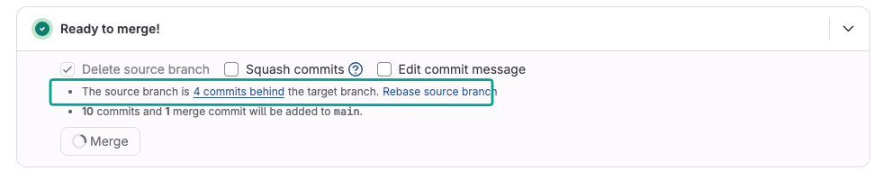

# Bài 16 — Merge, Rebase, Cherry-pick, Conflict và công cụ merge

> [Bài 9](09-branch-va-pull-request.md) đã gộp nhánh bằng **merge**. Bài này thêm hai cách nữa để đưa commit
> từ nhánh này sang nhánh kia: **rebase** và **cherry-pick**. Sau đó gom lại một chỗ: cả ba đều có thể gây
> **conflict**, và giải pháp là **một công cụ merge tốt + quy trình Merge Request/Pull Request** rõ ràng.

---

## 0. Chuẩn bị repo luyện tập

Bài này **không** tập trên repo chung. Mỗi người tự dựng một repo riêng trên máy, có sẵn đủ tình huống:

```bash
cd ~/Desktop
bash <đường-dẫn-tới>/GitThucHanh/tai-nguyen/tao-repo-luyen-tap-16.sh
cd luyen-tap-16/repo
git log --oneline --graph --all
```

Script tạo thư mục `luyen-tap-16/` gồm:

| Thư mục / nhánh | Dùng cho |
|---|---|
| `may-chu.git` | "Máy chủ" giả lập, nằm ngay trên máy bạn. Push, force-push thoải mái |
| `repo/` | Repo bạn làm việc. Mở bằng terminal hoặc GitKraken (**File → Open Repo**) |
| `feature/bao-cao` | Bài 16.1: rebase **không** conflict |
| `feature/thong-bao` | Bài 16.2: rebase **có** conflict |
| `feature/dang-nhap` | Bài 16.3: gộp 4 commit lặt vặt thành 1 |
| `release/1.0` | Bài 16.4: cherry-pick bản sửa VAT từ `main` sang |

> Làm hỏng thì xoá thư mục `luyen-tap-16` rồi chạy lại script. Không ảnh hưởng tới ai.

---

## 1. Ba cách đưa commit sang nhánh khác

| Cách | Làm gì | Lịch sử sau đó | Dùng khi |
|---|---|---|---|
| **Merge** | Gộp **cả nhánh** vào, tạo 1 commit merge có 2 cha | Giữ nguyên, có chạc | Mặc định khi đưa feature vào `main` |
| **Rebase** | **Nhấc** các commit của bạn, đặt lại lên đầu nhánh khác | Thẳng một đường, commit có **hash mới** | Cập nhật nhánh riêng theo `main` trước khi tạo PR |
| **Cherry-pick** | **Chép đúng 1 (vài) commit** sang nhánh hiện tại | Thêm commit mới, hash mới | Mang bản sửa lỗi sang nhánh release, cứu commit nhầm nhánh |

> **Mẹo nhớ:** rebase thực chất là **cherry-pick hàng loạt**: Git chép lần lượt từng commit của bạn lên gốc mới.
> Vì vậy cả hai đều tạo commit **mới** (hash khác), còn merge thì không đổi commit cũ.

---

## 2. Merge — ôn nhanh

Hai kiểu kết quả:

```
Fast-forward (main chưa đi thêm commit nào):
main     A───B                       main     A───B───C───D
              \              →
feature        C───D                 (main chỉ việc "trượt" lên D, không có commit merge)

Merge commit (cả hai bên đều có commit mới):
main     A───B───E                   main     A───B───E───────M
              \              →                     \         /
feature        C───D                 feature        C───D───/   (M có 2 cha: E và D)
```

```bash
git switch main
git pull
git merge feature/abc          # fast-forward nếu được, không thì tạo commit merge
git merge --no-ff feature/abc  # luôn tạo commit merge, để lịch sử thấy rõ "đã gộp nhánh"
```

Trên web, nút merge của PR/MR có 3 kiểu — xem lại [Bài 9, mục 4](09-branch-va-pull-request.md#4-ba-kiểu-merge-trên-github).

---

## 3. Rebase

### 3.1. Rebase làm gì?

Bạn tách nhánh từ `B`. Trong lúc bạn làm, đồng nghiệp đã merge thêm `E`, `F` vào `main`:

```
TRƯỚC                                   SAU  git rebase main
main     A───B───E───F                  main     A───B───E───F
              \                                               \
feature        C───D                    feature                C'───D'
```

Git **nhấc** `C`, `D` ra, rồi chép lại lần lượt lên đầu `F` thành `C'`, `D'`.
Nội dung thay đổi giữ nguyên, nhưng **hash đổi** vì commit cha đã đổi.

Kết quả: nhánh của bạn như thể vừa được tạo từ `main` mới nhất. Khi merge vào `main` sẽ là fast-forward,
lịch sử thẳng một đường, không có chạc.

### 3.2. Merge hay rebase?

| | Merge `main` vào nhánh mình | Rebase nhánh mình lên `main` |
|---|---|---|
| Lịch sử | Có thêm commit "Merge branch main…", chạc chằng chịt | Thẳng, dễ đọc |
| Commit cũ | Giữ nguyên hash | **Hash mới**, commit cũ bị thay |
| Conflict | Xử lý **1 lần** cho cả nhánh | Có thể phải xử lý **theo từng commit** |
| Sau đó push | `git push` bình thường | Phải `git push --force-with-lease` |
| An toàn cho người mới | ✅ Cao | ⚠️ Cần hiểu quy tắc vàng bên dưới |

### 3.3. Quy tắc vàng

> 🚨 **Chỉ rebase nhánh của riêng mình. Không bao giờ rebase nhánh người khác đang dùng chung**
> (`main`, `develop`, `release/*`, nhánh làm chung với đồng nghiệp).

Lý do: rebase tạo commit mới và **bỏ commit cũ**. Ai đang làm trên commit cũ sẽ bị lệch lịch sử hoàn toàn,
và push tiếp sẽ tạo ra commit trùng lặp.

### 3.4. Các lệnh

```bash
git switch feature/abc
git fetch origin                   # lấy main mới nhất về (chưa đụng code của bạn)
git rebase origin/main             # đặt các commit của bạn lên đầu main

# Nhánh đã từng push → phải đẩy đè, nhưng đè CÓ ĐIỀU KIỆN:
git push --force-with-lease
```

| Lệnh đẩy đè | Ý nghĩa |
|---|---|
| `git push --force` | 🚨 Đè luôn, kể cả khi đồng nghiệp vừa push lên nhánh đó → **mất code của họ** |
| `git push --force-with-lease` | ✅ Chỉ đè nếu nhánh trên máy chủ **vẫn như lần cuối bạn fetch**. Có ai push thêm → từ chối |

**`git pull --rebase`**: kéo code mới về và đặt commit chưa push của bạn lên trên, thay vì tạo commit merge.
Repo đang cấu hình `pull.rebase false` ([Bài 1](01-cai-dat-va-cau-hinh.md)) nên mặc định vẫn là merge.
Muốn rebase thì gõ rõ `--rebase` cho từng lần.

### Bài 16.1 — Rebase không conflict

```bash
git switch feature/bao-cao
git log --oneline --graph main feature/bao-cao     # thấy nhánh tách ra từ "thêm hướng dẫn sử dụng"
git rebase main
# Successfully rebased and updated refs/heads/feature/bao-cao.
git log --oneline --graph main feature/bao-cao     # giờ nhánh nằm thẳng trên đầu main

git push                      # ❌ bị từ chối — vì lịch sử đã khác bản trên máy chủ
git push --force-with-lease   # ✅ (forced update)
```

So sánh hash 2 commit của bạn **trước và sau** rebase. Vì sao chúng khác nhau?

### Bài 16.2 — Rebase có conflict

```bash
git switch feature/thong-bao
git rebase main
```

```
CONFLICT (content): Merge conflict in config/app.yml
error: could not apply f5e057b... feat: gửi thông báo qua Zalo
hint: Resolve all conflicts manually, mark them as resolved with
hint: "git add/rm <conflicted_files>", then run "git rebase --continue".
```

Mở `config/app.yml`:

```
<<<<<<< HEAD
  thong_bao: email
=======
  thong_bao: zalo
>>>>>>> f5e057b (feat: gửi thông báo qua Zalo)
```

> ⚠️ **Chú ý: khi rebase, `HEAD` là bản của `main`, KHÔNG phải của bạn.**
> Bản của bạn là khối phía dưới, có kèm tên commit. Xem giải thích ở [mục 6](#62-head--ours--theirs-đảo-ngược-khi-rebase).

`main` đã chuyển thông báo sang email, còn bạn thêm Zalo. Muốn **giữ cả hai**:

```yaml
  thong_bao: [email, zalo]
```

```bash
git add config/app.yml
git rebase --continue          # mở editor để xác nhận message, lưu và đóng là xong
git log --oneline -3
git push --force-with-lease
```

Rối quá thì `git rebase --abort`: mọi thứ quay về như trước khi rebase.

---

## 4. Gộp nhiều commit thành một (squash)

Lịch sử nhánh `feature/dang-nhap`:

```
6928d31 sửa typo
f89334a fix lại
fa4a6eb fix
61b72b5 feat: thêm trang đăng nhập
```

Người review không cần biết bạn đã "fix lại" mấy lần. Gộp thành **1 commit có nghĩa** trước khi merge.

### Cách 1 — Để máy chủ gộp lúc merge (dễ nhất)

| Nền tảng | Làm thế nào |
|---|---|
| GitHub | Nút merge của PR → chọn **Squash and merge** |
| GitLab | Tick ô **Squash commits** trên MR trước khi bấm **Merge** |
| Dòng lệnh | `git switch main && git merge --squash feature/dang-nhap && git commit` |

Nhánh của bạn giữ nguyên, nhưng `main` chỉ nhận **1 commit**.

### Cách 2 — `git rebase -i` (chủ động, linh hoạt nhất)

```bash
git switch feature/dang-nhap
git rebase -i main
```

Git mở editor với danh sách commit, **cũ nhất ở trên cùng** (ngược với `git log`):

```
pick 61b72b5 feat: thêm trang đăng nhập
pick fa4a6eb fix
pick f89334a fix lại
pick 6928d31 sửa typo
```

Sửa chữ đầu dòng rồi lưu, đóng editor:

```
pick 61b72b5 feat: thêm trang đăng nhập
fixup fa4a6eb fix
fixup f89334a fix lại
fixup 6928d31 sửa typo
```

| Lệnh | Viết tắt | Tác dụng |
|---|---|---|
| `pick` | `p` | Giữ nguyên commit |
| `reword` | `r` | Giữ commit, **sửa message** |
| `squash` | `s` | Gộp vào commit phía trên, **ghép cả hai message** để bạn sửa |
| `fixup` | `f` | Gộp vào commit phía trên, **bỏ message** của commit này |
| `drop` | `d` | Xoá hẳn commit |

> Editor mặc định là **vim** khá khó dùng. Đổi sang VS Code một lần cho xong:
> `git config --global core.editor "code --wait"`

### Cách 3 — `git reset --soft` (không cần editor)

```bash
git switch feature/dang-nhap
git reset --soft main          # "tháo" hết commit, thay đổi vẫn nằm sẵn trong staging
git commit -m "feat: thêm trang đăng nhập"
```

### Bài 16.3 — Gộp 4 commit thành 1

1. Làm theo **Cách 2**, giữ `pick` cho commit đầu, `fixup` cho 3 commit sau.
2. Kiểm tra: `git log --oneline main..HEAD` chỉ còn **1 dòng**, file `dang-nhap.md` vẫn đủ 4 mục và đã hết lỗi "mật khẫu".
3. `git push --force-with-lease`
4. Làm lại bằng **Cách 3** (khôi phục trước bằng `git reset --hard origin/feature/dang-nhap` nếu chưa push).

---

## 5. Cherry-pick — chép đúng một commit

```
main         A───B───E───F───V          V = "fix: sửa thuế VAT từ 8% thành 10%"
                  \
release/1.0        R                     bản đang chạy cho khách, cần V nhưng KHÔNG cần E, F

        git switch release/1.0 && git cherry-pick V
                  ↓
release/1.0        R───V'               V' cùng nội dung với V, nhưng là commit mới (hash khác)
```

### Khi nào dùng, khi nào không

| ✅ Nên dùng | ❌ Không nên |
|---|---|
| Mang **bản sửa lỗi** từ `main` sang nhánh `release` hoặc `hotfix` | Thay cho merge cả nhánh: chép dần từng commit sẽ làm lịch sử trùng lặp |
| **Commit nhầm nhánh**: chép sang nhánh đúng rồi gỡ ở nhánh sai | Lấy 1 commit **phụ thuộc** vào commit khác chưa có ở nhánh đích |
| Lấy **một phần việc đã xong** từ nhánh chưa merge được | Dùng thường xuyên: nếu tuần nào cũng cherry-pick, quy trình nhánh đang có vấn đề |

### Các lệnh

```bash
git switch <nhánh-đích>                  # LUÔN đứng ở nhánh NHẬN commit
git cherry-pick a1b2c3d                  # chép 1 commit
git cherry-pick -x a1b2c3d               # ✅ khuyên dùng: ghi thêm "(cherry picked from commit …)" vào message
git cherry-pick a1b2c3d e4f5a6b          # chép nhiều commit
git cherry-pick a1b2c3d^..e4f5a6b        # chép cả dải, TÍNH CẢ a1b2c3d
git cherry-pick -n a1b2c3d               # chép thay đổi nhưng CHƯA commit, để sửa thêm

# Khi có conflict:
git cherry-pick --continue               # sau khi sửa xong + git add
git cherry-pick --abort                  # huỷ, quay về như cũ
```

### Bài 16.4 — Mang bản sửa VAT sang `release/1.0`

```bash
git log main --oneline --grep=VAT        # tìm hash commit sửa VAT
git switch release/1.0
tail -1 bang-gia.md                      # Thuế VAT: 8%
git cherry-pick -x <hash-vừa-tìm>
tail -1 bang-gia.md                      # Thuế VAT: 10%
git log -1                               # thấy dòng "(cherry picked from commit …)"
git push
```

Trả lời: hash của commit VAT trên `release/1.0` có giống trên `main` không? Vì sao?

### Bài 16.5 (thêm) — Cứu commit nhầm nhánh

```bash
git switch main
echo "3. Bấm Báo cáo để xem doanh số." >> huong-dan.md && git commit -am "docs: hướng dẫn xem báo cáo"
# Ối, đáng lẽ phải commit vào feature/bao-cao!

git switch feature/bao-cao
git cherry-pick main                     # "main" lúc này trỏ đúng commit vừa tạo nhầm
git switch main
git reset --hard origin/main             # gỡ commit nhầm — CHỈ làm được vì CHƯA push
```

---

## 6. Conflict — chung cho cả ba thao tác

### 6.1. Cùng một cơ chế, cùng một bộ lệnh

Merge, rebase hay cherry-pick đều dùng chung cơ chế **gộp 3 phía**. Conflict xảy ra khi hai bên sửa **cùng một chỗ**,
và Git dừng lại chờ bạn quyết.

| Đang làm | Sửa xong rồi | Bỏ qua commit này | Huỷ hết, quay về như cũ |
|---|---|---|---|
| `merge` | `git add` → `git commit` | — | `git merge --abort` |
| `rebase` | `git add` → `git rebase --continue` | `git rebase --skip` | `git rebase --abort` |
| `cherry-pick` | `git add` → `git cherry-pick --continue` | `git cherry-pick --skip` | `git cherry-pick --abort` |

> Rebase chép **từng commit một**, nên có thể dừng lại **nhiều lần**. Mỗi lần dừng: sửa → `add` → `--continue`.

### 6.2. HEAD / ours / theirs đảo ngược khi rebase

| Thao tác | Khối `<<<<<<< HEAD` (ours) | Khối `>>>>>>>` (theirs) |
|---|---|---|
| `merge feature` (đứng ở `main`) | `main`, nhánh **bạn đang đứng** | `feature`, nhánh **được gộp vào** |
| `cherry-pick X` | Nhánh **bạn đang đứng** | Commit `X` được chép sang |
| `rebase main` (đứng ở `feature`) | ⚠️ **`main`**, gốc mới | ⚠️ **Commit của bạn** |

Lý do: khi rebase, Git chuyển sang đứng ở `main` rồi chép commit của bạn lên. Vì vậy "ours" lúc đó là `main`.
Đây là chỗ người mới hay chọn nhầm nhất, kể cả khi dùng `git checkout --ours`.

### 6.3. Năm bước xử lý

1. `git status`: xem **đang làm thao tác gì** (merge / rebase / cherry-pick) và **file nào** conflict.
2. Mở **công cụ merge** (`git mergetool`, VS Code, GitKraken…), không sửa tay bằng mắt nếu file dài.
3. Với mỗi khối: lấy bên này, bên kia, **cả hai**, hoặc viết lại.
4. Chạy thử / đọc lại file: không còn sót `<<<<<<<`, `=======`, `>>>>>>>`.
5. `git add <file>` → lệnh `--continue` (hoặc `commit` với merge).

> Muốn thấy luôn **bản gốc** ngay trong file khi conflict:
> `git config --global merge.conflictstyle zdiff3` → Git chèn thêm khối `||||||| base` ở giữa.

---

## 7. Giải pháp: vì sao cần một công cụ merge tốt

Dấu `<<<<<<<` trong file chỉ là **phương án tối thiểu** của Git. Với conflict thật, nó không đủ:

| Vấn đề khi sửa tay | Công cụ merge giải quyết thế nào |
|---|---|
| Chỉ thấy **2 bản**, không biết **ban đầu** là gì, nên không biết ai đổi gì | Hiện đủ **3 cột: Base · Bản này · Bản kia** + khung **Kết quả** ([Bài 14](14-compare-tool.md#vì-sao-merge-cần-3-cột-không-phải-2)) |
| **HEAD/ours/theirs đảo ngược** khi rebase, rất dễ chọn nhầm | Ghi rõ **tên nhánh / tên commit** trên từng cột |
| Conflict **nhiều file, nhiều khối**, dễ bỏ sót | Danh sách file + nút **khối kế tiếp**, đếm số conflict còn lại |
| Dễ **commit sót dấu `<<<<<<<`** lên `main` | Chỉ cho đánh dấu "đã xong" khi mọi khối đã được chọn |
| Phần **không đụng nhau** vẫn phải đọc từng dòng | Tự gộp phần không xung đột, chỉ dừng ở chỗ thật sự đụng nhau |
| Thay đổi trong **một dòng dài** (cấu hình, JSON) khó nhìn | Tô màu tới **từng ký tự** khác nhau |
| Người **không code** (viết tài liệu trên Obsidian) không đọc nổi dấu `<<<` | Bấm chọn bằng chuột, không cần hiểu cú pháp |

**Thời gian xử lý một conflict = thời gian *hiểu* hai bên đã đổi gì.** Công cụ tốt rút ngắn đúng phần đó.

Các lựa chọn của team (cấu hình chi tiết ở [Bài 14](14-compare-tool.md)):

| Công cụ | Chi phí | Điểm mạnh |
|---|---|---|
| **VS Code** (Merge Editor) | Miễn phí | Có sẵn, 3 cột + kết quả, nút *Accept Current / Incoming / Both* |
| **GitKraken** | Miễn phí với repo public và repo local | Đồ thị nhánh + công cụ gộp tích hợp, làm được cả rebase, cherry-pick bằng chuột |
| **SourceGit bản team** | Miễn phí | Nhẹ, giao diện giống GitKraken, dùng được với repo private |
| **Beyond Compare / bản nội bộ** | Có phí / nội bộ | So sánh cả thư mục, mạnh nhất cho file lớn |

---

## 8. Merge Request = Pull Request

**Cùng một thứ, khác tên theo nền tảng.** "Pull Request" vì bạn *xin chủ repo pull* code của bạn về (GitHub).
"Merge Request" vì bạn *xin merge* nhánh của bạn vào nhánh đích (GitLab). Quy trình y hệt: mở → review → sửa → duyệt → merge.

| Khái niệm | GitHub | GitLab |
|---|---|---|
| Yêu cầu gộp code | **Pull Request** (PR) | **Merge Request** (MR) |
| Nhánh của bạn / nhánh đích | compare / base | **source branch** / **target branch** |
| Bản nháp | Draft pull request | Draft (đặt `Draft:` trước tiêu đề) |
| Gộp commit khi merge | Nút **Squash and merge** | Ô **Squash commits** |
| Cập nhật nhánh theo đích | Nút **Update branch** | Nút **Rebase source branch** |
| Xoá nhánh sau merge | Nút **Delete branch** | Ô **Delete source branch** |
| Người duyệt | Reviewers → *Approve* | Reviewers / Approvers → *Approve* |

### Đọc một màn hình Merge Request thật



| Dòng trên màn hình | Nghĩa là gì | Làm gì |
|---|---|---|
| **Ready to merge!** | Đã đủ duyệt, pipeline xanh | Có thể merge |
| ☑ **Delete source branch** | Xoá nhánh sau khi merge | Nên để tick |
| ☐ **Squash commits** | Gộp toàn bộ commit của MR thành 1 | Tick nếu nhánh nhiều commit lặt vặt ([mục 4](#4-gộp-nhiều-commit-thành-một-squash)) |
| *The source branch is **4 commits behind** the target branch* | `main` đã có thêm 4 commit từ lúc bạn tách nhánh | Bấm **Rebase source branch**, hoặc tự `git rebase origin/main` + `push --force-with-lease` ([mục 3](#3-rebase)) |
| *10 commits and 1 merge commit will be added to main* | Merge xong `main` nhận 10 commit + 1 commit merge | Muốn gọn hơn: tick Squash → chỉ còn 1 commit |

---

## 9. Làm bằng GitKraken

Mở repo luyện tập: **File → Open Repo** → chọn `luyen-tap-16/repo`.

| Thao tác | Trong GitKraken |
|---|---|
| **Merge** | Kéo nhánh nguồn **thả lên** nhánh đích (ở cột trái hoặc trên đồ thị) → **Merge `<nguồn>` into `<đích>`** |
| **Rebase** | Kéo thả như trên → **Rebase `<nhánh>` onto `<đích>`** |
| **Gộp commit** | Kéo thả → **Interactive Rebase**; mỗi commit chọn *Pick / Reword / Squash / Drop* → **Start Rebase**. Bản mới: chọn nhiều commit (`Cmd/Ctrl` + click) → chuột phải → **Squash** |
| **Cherry-pick** | Đứng ở nhánh đích (double-click tên nhánh) → chuột phải commit cần lấy → **Cherry pick commit** |
| **Conflict** | Khung bên phải hiện file conflict → bấm vào file → công cụ gộp: tick chọn khối của từng bên, xem ở khung **Output** → **Save** → **Continue** (hoặc **Abort**) |
| **Đẩy đè sau rebase** | Bấm Push → bị từ chối → GitKraken hỏi → **Force Push** |
| **Tạo PR / MR** | Kéo nhánh của mình thả lên `origin/main` → **Start a pull request**; hoặc mục **Pull Requests** ở cột trái → nút **+** |

> Tên mục có thể khác chút giữa các phiên bản GitKraken. Bản miễn phí dùng được với repo public và repo trên máy;
> repo private trên GitHub/GitLab cần bản trả phí → dùng **SourceGit bản team** hoặc Fork, thao tác gần như giống hệt.

**Bài 16.6:** làm lại 16.1 → 16.4 trong GitKraken. Trước đó chạy lại script với tên thư mục khác:
`bash tao-repo-luyen-tap-16.sh luyen-tap-16-gitkraken`.

---

## 10. Cứu hộ: rebase hỏng, squash nhầm

Commit "biến mất" sau rebase/reset **vẫn còn** trong Git ít nhất 30 ngày. `git reflog` ghi lại mọi chỗ HEAD từng đứng:

```bash
git reflog
# e093f59 HEAD@{0}: rebase (finish): returning to refs/heads/feature/dang-nhap
# ...
# a89ea0b HEAD@{5}: checkout: moving from feature/thong-bao to feature/dang-nhap   ← trước khi rebase

git reset --hard HEAD@{5}       # quay về đúng trạng thái đó
git reset --hard ORIG_HEAD      # hoặc: huỷ ngay thao tác rebase/merge/reset VỪA làm
```

---

## 11. Bảng dán nhanh

```bash
# Rebase nhánh mình lên main mới nhất
git fetch origin && git rebase origin/main
git add <file> && git rebase --continue      # sau mỗi lần sửa conflict
git rebase --abort                           # huỷ
git push --force-with-lease

# Gộp commit
git rebase -i main                           # pick commit đầu, fixup các commit sau
git reset --soft main && git commit -m "…"   # cách không cần editor

# Cherry-pick
git switch <nhánh-nhận> && git cherry-pick -x <hash>
git cherry-pick --continue | --abort

# Conflict
git status
git mergetool
git merge --abort | git rebase --abort | git cherry-pick --abort

# Cứu hộ
git reflog
git reset --hard ORIG_HEAD
```

---

## 12. Câu hỏi

1. Merge, rebase, cherry-pick: cái nào **giữ nguyên** hash của commit cũ? Cái nào tạo commit mới?
2. Vì sao sau khi rebase phải `push --force-with-lease`? Nó khác `--force` ở đâu?
3. Bạn đang rebase và gặp conflict. Khối `<<<<<<< HEAD` là code của ai?
4. Đồng nghiệp đang làm chung nhánh `feature/thanh-toan` với bạn. Bạn có nên rebase nhánh đó không? Vì sao?
5. Trên GitLab MR báo *"4 commits behind the target branch"*. Bạn có mấy cách xử lý?
6. `squash` và `fixup` trong `git rebase -i` khác nhau ở đâu?
7. Khi nào cherry-pick là **dấu hiệu quy trình có vấn đề**?
8. Nêu 3 lý do nên dùng công cụ merge thay vì sửa tay các dấu `<<<<<<<`.
